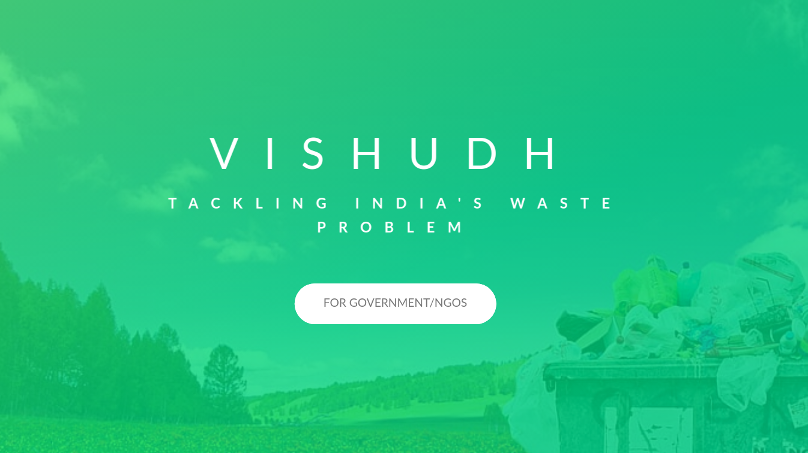
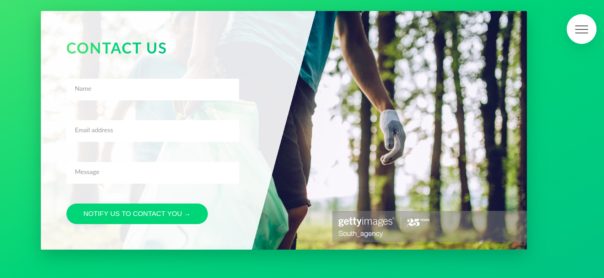

<!-- [![Contributors][contributors-shield]][contributors-url]
[![Forks][forks-shield]][forks-url]
[![Stargazers][stars-shield]][stars-url]
[![Issues][issues-shield]][issues-url]
[![MIT License][license-shield]][license-url]
[![LinkedIn][linkedin-shield]][linkedin-url] -->

# Project Visudh
> This README file explains almost evrything about our Project's awesome Website.

## Table of Contents

* [About the Website](#about-the-website)
* [Contents of the Website](#contents-of-the-website)  
* [For NGOs](#for-ngos)
* [For Goverment Officials](#for-goverment-officials)
* [Built With](#built-with)

## About The Website

For citizens, we have the Smartphone App. But for high-scale tasks like sending out the list of uncleaned areas for th NGOs, which could be very long or reviewing the unattended areas not cleaned or selected after 3 days, we have developed a user-friendly Website. This website helps in a better, unbiased, automated and efficient communication and connectivity between the NGOs and Government Bodies like Municipalities.  

## Contents of the Website

The Website's landing page contains description of our Project and a list of 3 NGOs from all across India, contributing the most to this noble Country-Service. It also contains dynamically customizable "Trending News" and "Maps" sections, based on user's Geo-Location. The Maps here are displayed as 2 different types - "Heat Map" and "Pin Map". Heat Map shows a General Overview of the current Garbage index in the Country, while a Pin Map is for a more Precise Overview of the same index near your Neighbourhood. It also has a "Contact Us" form in case an NGO or any other User wanted to ping us.  

We also have a Login/Signup page where both NGOs and Government Officials(as admins) can register and login and a "Top Contributing" page where we display the list of most actively participating Citizens and NGOs customizable to the viewer's location.  

## For NGOs

If one logs in as an NGO, with its Unique Identification No. issued by the NITI Aayog, we have a NGO Profile page where all the areas taken/completed under that particular NGO is displayed. There is a rating graph for every NGO, where it can see its previous and current performances and keep on improving. We also have a "List Areas" page where NGOs can actively look for new areas and an Image Gallery where it can see the pictures of the areas to decide the scale of the undertaking and plan every thing beforehand.    

## For Goverment Officials

If one logs in as a Government Official(admin), the person can release the list of uncleaned areas for the NGOs to see and undertake. Then, it can visit any NGO's profile and update its rating based on that NGO's work. It can also delete(ban) an NGO and debaar its license if the NGO repeatedly lies about completing its undertaken areas.   

## Built With

* HTML5
* CSS3 (with Bootstrap & SCSS)
* Javascript (with jQuery)
* Django
* SQLite 
* Google Maps API 
 
Some extra libraries and frameworks like Google Fonts and Font Awesome to beautify the Website. 

  
